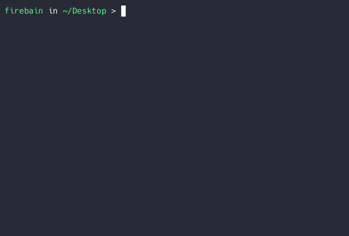

# tssh - Convenient CLI client for teleport

`tssh` is a wrapper around the Teleport CLI client, designed to simplify connections to servers by enabling autocompletion and fuzzy searching. This project aims to streamline the process of connecting to servers via the command line, making it more intuitive and user-friendly.



## Installation

### Prerequisites

- **MacOS** - For now, it only supports MacOS
- [Teleport CLI](https://goteleport.com/docs/installation/)
- [Golang](https://go.dev/dl/)

### Install

```sh
go install github.com/Firebain/tssh
```

### Uninstall

```sh
tssh cache prune
```

```sh
rm $(which tssh)
```

## Usage

### Pre-requisites

`tssh` uses the same authentication method as `tsh`. Ensure you have logged in using `tsh` at least once:

```sh
tsh login --proxy=teleport.example.com
```

### Basic Commands

Simply run `tssh` by calling it in the console:

```sh
tssh
```

#### Automatic Authorization

`tssh` supports automatic authorization with password and OTP when your session is expired.

##### Login

To enable automatic authorization, use the following command:

```sh
tssh login
```

This command will prompt you for your password and OTP secret, and then store it in keychain.

##### Logout

To disable the automatic authorization feature, simply run:

```sh
tssh logout
```

This command will remove the password and OTP secret from keychain.

#### Cache operations

Under the hood, tssh uses a cache for the list of servers.

##### Location

Returns the path to the cache file.

```sh
tssh cache location
```

##### Prune

Completely deletes the cache folder.

```sh
tssh cache prune
```

### Update server list

To update the server list while running `tssh`, press `ctrl+r`.

### Changing SSH User

To change the SSH user while running `tssh`, press `ctrl+u`.

## License

This project is licensed under the MIT License. See the [LICENSE](./LICENSE.txt) file for more details.
